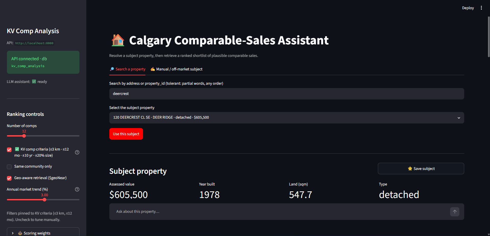
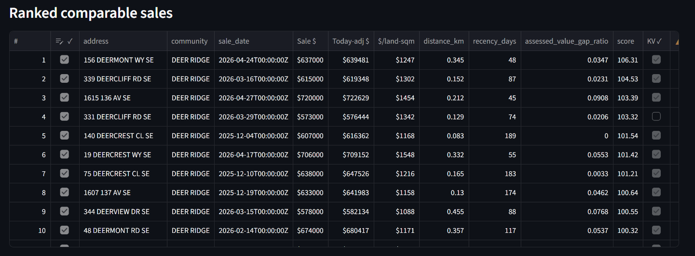
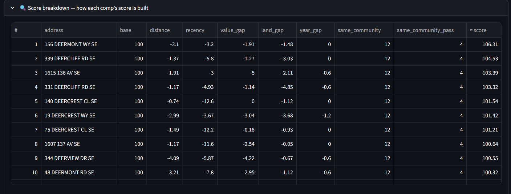
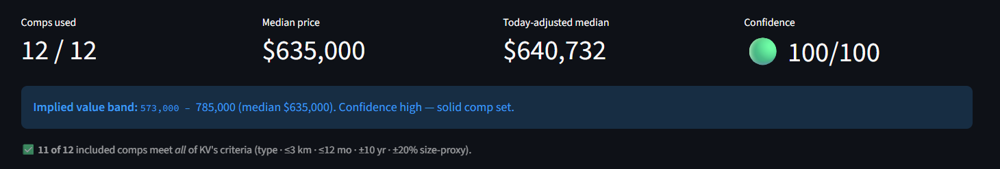
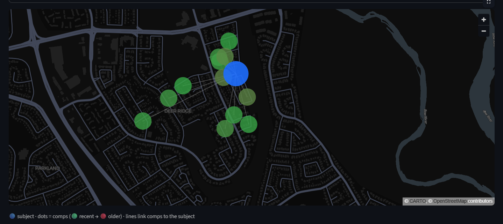
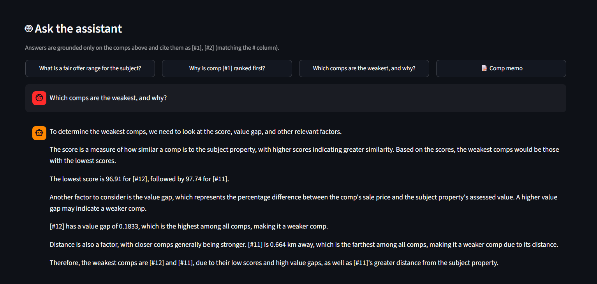
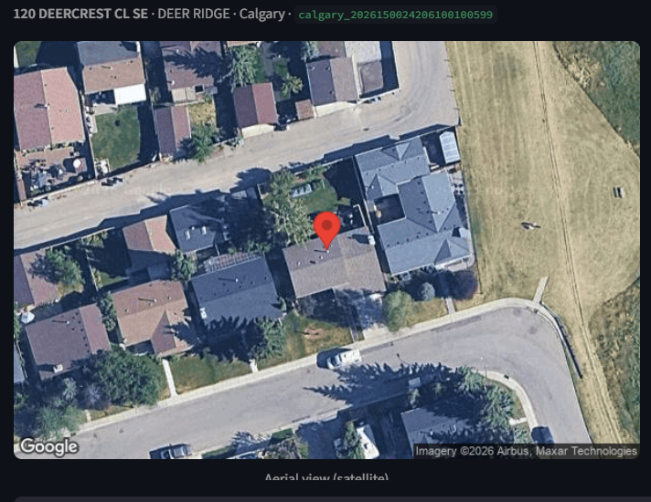

<div align="center">

# 🏠 KV Capital — Calgary Comparable-Sales Assistant

**Give it a property. Get a ranked, explained shortlist of comparable sales in seconds — so an underwriter starts from a strong first draft instead of a blank page.**


-F55036)


### 🎥 [**Watch the demo (Loom)**](https://www.loom.com/share/23ac32065bef47f48d0be2b66b1780d9)

📋 Built for the KV Capital AI-Engineer hackathon

<!-- 📸 HERO SHOT: replace with the main app — subject card + ranked comps + map all visible. -->


</div>

---

## Table of contents

- [What it does](#what-it-does)
- [How the ranking works](#-how-the-ranking-works) ← the core
- [The data](#the-data)
- [Architecture](#architecture)
- [Quickstart](#quickstart)
- [Tech stack](#tech-stack)
- [Testing](#testing)
- [Design decisions & honest tradeoffs](#design-decisions--honest-tradeoffs)
- [How this maps to KV's brief](#how-this-maps-to-kvs-brief)
- [Project structure](#project-structure)
- [Screenshots](#screenshots)
- [License / IP](#license--ip)

---

## What it does

Real-estate-debt underwriting starts with one question: **what is this property worth?** The honest
answer is *comps* — finding comparable recent sales and reasoning about them. It's slow, expert work.
This tool does the first, highest-leverage step: **retrieve and rank plausible comparable sales, and
explain the reasoning** — while keeping the final pick human.

| | Feature |
|---|---|
| 🔎 | **Tolerant search** — partial words, any order (`lynnwood dr` → `… DR …`); plus **manual / off-market** entry for a property not in the data (e.g. a builder's new build) |
| 🎯 | **Ranked comparable sales** — a 0–100 similarity score per comp, with a **KV-criteria ✓** (same type · ≤3 km · ≤12 mo · ±10 yr · ±20 % size) and a transparent **score breakdown** |
| 💲 | **Implied value band** (low / median / high) + a **confidence score**, `$/land-sqm`, and **time-adjusted "today's-equivalent" prices** |
| 🗺️ | **Interactive map** (subject pin, comps coloured by recency, lines to each), a **pinned aerial** of the subject, and price / distance / timeline charts |
| 🤖 | **Grounded AI assistant** — streaming Q&A + a one-click comp memo, cites comps `[#1] [#2]`, **refuses to invent numbers**, and is **machine-checked** for fabrication |
| 📄 | **Underwriting handoff** — a CSV with blank `Adj % / Adj $ / notes` for the 41HP template, and a one-page **PDF** |
| ✅ | **Human-in-the-loop** — exclude any comp and the value band + confidence recompute live; the underwriter makes the call |

---

## ▶ How the ranking works

This is the heart of the project. Given a subject property, the engine
([`scripts/comp_ranking_service.py`](scripts/comp_ranking_service.py)) runs four stages:

```
 Subject ──▶ 1. RETRIEVE (widening, geo-first) ──▶ 2. FILTER (hard limits)
                                                        │
        4. RANK & SUMMARise ◀── 3. SCORE (0–100 similarity) ◀┘
```

<!-- 📸 Capture: the ranked comps table (KV criteria on) for this section. -->


### 1 · Retrieve — a widening, geography-first search

Comps are gathered over a grid of **passes × profiles**, from strictest to loosest, stopping early once
there are enough good candidates:

- **Passes:** `same community` → `same city`
- **Profiles:** `tight` → `balanced` → `wide`

| Profile | Max distance | Max sale age | Max value gap | Max age gap |
|---|---|---|---|---|
| tight | 4 km | 365 days | 20 % | 10 yrs |
| balanced | 8 km | 540 days | 35 % | 18 yrs |
| wide | 15 km | 730 days | 50 % | 25 yrs |

For each pass, candidates are pulled **nearest-first** with MongoDB **`$geoNear`** over a `2dsphere`
index — so we get the closest plausible sales, not just the most recent. (The **KV-criteria toggle** in
the UI pins the search to *tight* — ≤3 km, ≤12 months — matching the rules from the underwriting call.)

The database query also enforces, server-side: **same property type**, the profile's **sale-date** and
**assessed-value** window, and a **true-sale guard** (`sale_price > 0`) so unsold listings never count —
a top reason humans reject a comp.

### 2 · Filter — the hard gate

Each candidate must pass the active profile's limits on **distance, value gap, lot-size gap, and
year-built gap**. Anything outside is dropped before it can score. This is also where the per-comp
**`kv_criteria`** checklist is computed (type · within 3 km · within 12 months · within 10 years · within
20 % size) and surfaced as the **KV ✓** column.

### 3 · Score — a transparent 0–100 similarity

Every survivor starts at **100** and loses points for each way it differs from the subject, then gains a
bonus for being in the same community:

| Signal | Points | Cap |
|---|---|---|
| Distance from subject | **−9** / km | −35 |
| Sale recency | **−2** / month old | −22 |
| Assessed-value gap | **−0.55 ×** gap % | −22 |
| Lot-size gap | **−0.22 ×** gap % | −12 |
| Year-built gap | **−0.6** / year | −12 |
| Bedrooms gap \* | −3 each | −9 |
| Bathrooms gap \* | −3 each | −9 |
| Garage gap \* | −2 each | −6 |
| **Same community** | **+12** | — |
| Found in the same-community pass | +4 | — |

\* only applied when the subject actually provides beds/baths/garage (e.g. a manual subject).

> **Worked example.** A comp **0.3 km** away, sold **40 days** ago, **1.2 %** value gap, **2 %** lot gap,
> **1 year** newer, **same community**:
> `100 − (0.3×9) − (40/30×2) − (1.2×0.55) − (2×0.22) − (1×0.6) + 12 + 4 ≈ **108.9**`.
> The same-community bonuses are intentional, so a perfect local comp can sit **just above 100** — the
> score is a *relative similarity ranking*, not a percentage. Every term is shown in the UI's **Score
> breakdown** so the ranking is fully auditable.

The weights above are the defaults; the **sidebar sliders** (distance / recency / value-gap / community)
feed straight into them, so changing a slider **re-ranks live**.

### 4 · Rank & summarise

Survivors are sorted by score (highest first), the top *N* are returned, and the set is summarised into an
**implied value band** (min / median / max of the comp prices) and a **confidence score** driven by how
many comps were found, how tightly their prices cluster, and how recent they are. Untick a comp in the UI
and the band + confidence recompute instantly — the same `summarize_value` function the API uses.

---

## The data

> Datasets are **gitignored** (multi-GB raw, hundreds of MB processed). Full details + a one-command
> rebuild are in [`data/README.md`](data/README.md).

1. **Source** — the City of Calgary's public property-assessment records (the same kind of public info KV
   already uses for beds/baths/sale details).
2. **Normalise** — cleaned into one consistent shape: type, year built, lot size, location, assessed value.
3. **Synthesise sales** — real arm's-length prices aren't public, so the pipeline generates **realistic
   stand-in sales** to retrieve against (see the honest caveat below).
4. **Load** — into **MongoDB Atlas** (`kv_comp_analysis`): **120,313 properties · 69,582 sales**, with a
   `2dsphere` geo index (the "within 3 km" search) and a compound hot-query index — both auto-ensured on
   API startup. Trimmed to a free-tier, **city-wide** slice; rebuildable from the `pipeline/` scripts.

---

## Architecture

```
 Streamlit UI ──HTTP──▶ FastAPI ──▶ CompRankingService ──▶ MongoDB Atlas
   (app/)               (scripts/api_main.py)   (scripts/comp_ranking_service.py)
                            │
                            └──▶ LLMService (Groq) — grounded explanation, machine-verified
```

- **Engine** — deterministic retrieval + scoring (above). Reused by both a CLI and the API.
- **API** — `GET /health` · `GET /subject-search` · `POST /rank-comps` · `POST /ask` · `POST /ask/stream`.
  Full contract in [`README_API.md`](README_API.md).
- **LLM** — Groq (Llama 3.3 70B), grounded **only** on the retrieved comps, temperature 0, and
  **post-checked** so every `[#n]` is a real comp and every $ figure sits inside the comp price range.
- **UI** — a thin HTTP client; does no ranking itself (it even imports the engine's `summarize_value` so the
  value band can never drift from the API).

---

## Quickstart

**Prereqs:** Python 3.11+ and a MongoDB Atlas connection string. A [Groq API key](https://console.groq.com)
enables the AI assistant (optional).

```bash
# 1. configure
cp .env.example .env          # paste MONGODB_URI (and GROQ_API_KEY for the assistant)
```

### Option A — Docker (both services, one command)

```bash
docker compose up --build
# UI → http://localhost:8501   ·   API docs → http://localhost:8000/docs
```

### Option B — local (two terminals)

```bash
python -m venv .venv
# activate:  Windows → .venv\Scripts\activate   ·   macOS/Linux → source .venv/bin/activate

# Terminal 1 — API
pip install -r requirements.txt
python -m uvicorn api_main:app --app-dir scripts --port 8000

# Terminal 2 — UI
pip install -r requirements-ui.txt
python -m streamlit run app/streamlit_app.py
```

> First time only: the data must be loaded into Atlas — see [`data/README.md`](data/README.md).

---

## Tech stack

**Python · FastAPI · Pydantic v2 · MongoDB Atlas (`$geoNear` / 2dsphere) · Streamlit · pydeck · Altair ·
fpdf2 · Groq (Llama 3.3 70B, OpenAI-compatible) · Docker / docker-compose · pytest.**
Imagery: no-key Esri aerial + optional Google Street View / Static Maps.

---

## Testing

```bash
pip install -r requirements-dev.txt
pytest            # 39 DB-free / network-free unit tests
```

Covers the scoring math, filter-tightening invariants, KV-criteria edges, the value-band/confidence
summary, address tokenisation, and the **LLM grounding verifier**. The API and full UI were also verified
end-to-end against live Atlas (FastAPI `TestClient` + Streamlit `AppTest`). A live smoke test:
`python scripts/smoke_test.py`.

---

## Design decisions & honest tradeoffs

- **Deterministic retrieval, LLM only explains.** For a lending decision the comp set must be reproducible
  and auditable, so ranking is plain code (same inputs → same comps, with a visible score breakdown) and
  the model is kept on a tight leash. Trust over agentic flash. (Swapping in an LLM tool-calling loop over
  the same endpoints is a small change if wanted.)
- **No living-area (sqft).** The open data has **lot** size, not finished floor area — so "size within
  20 %" uses a lot-size proxy plus beds/baths/value. The weighted engine ingests true GLA in ~one line if
  the dataset provides it. We chose to label it honestly rather than fake the one criterion we can't fully meet.
- **⚠️ Synthetic-price caveat.** The stand-in `sale_price` is derived from each property's `assessed_value`,
  so the value band leans on assessment more than it would in real life. With real arm's-length MLS prices
  the same engine surfaces genuine market signal — we flag this rather than let it read as a real valuation.
- **Scope was a choice.** The imagery, PDF/CSV handoff, permalinks and Docker are demo/handoff polish; given
  more time we'd reinvest it in comp-selection depth (true GLA, a per-feature dollar-adjustment grid).

---

## How this maps to KV's brief

| KV "trustworthy comp" criterion | Where it lives |
|---|---|
| Same property **type** | hard filter on `property_type_normalized` |
| Within **~3 km** | `$geoNear` + KV-criteria preset pins 3 km |
| Sold in the **last 6–12 months** | KV-criteria preset pins 365 days; recency penalty |
| **Size** within ~20 % | lot-size gap proxy (+ beds/baths/value) |
| **Age** within 10 years | tightest profile `max_year_gap = 10` |
| **True sale** only | `true_sales_only` guard |
| **Key fields pre-filled** | price, $/land-sqm, today-adjusted, distance, recency, beds/baths/garage, score, reasons |
| **Decision stays human** | exclude toggles · "verify manually" panel · LLM never decides |
| Output → **41HP template** | underwriting CSV + PDF handoff |

Judged on the five rubric dimensions: clean layered code with 39 tests; a grounded, machine-verified LLM;
transparent scoring + honest data thinking; thorough docs + a Loom; and explicit scope choices.
The < 10-min walkthrough is the [demo video](https://www.loom.com/share/23ac32065bef47f48d0be2b66b1780d9).

---

## Project structure

```
kv-comp-analysis/
├── scripts/                     # runtime service
│   ├── comp_ranking_service.py  #   the comp engine (retrieve · filter · score · rank)
│   ├── comp_analysis.py         #   shared value-band + confidence (one source of truth)
│   ├── llm_service.py           #   grounded Groq client + grounding verifier
│   ├── api_main.py · api_models.py · api_config.py   # FastAPI
│   └── smoke_test.py
├── app/streamlit_app.py         # demo UI (thin HTTP client)
├── pipeline/                    # one-off ETL that built the dataset
├── tests/                       # pytest (DB/network-free)
├── data/                        # gitignored datasets (see data/README.md)
├── docs/screenshots/            # images used in this README
├── Dockerfile.api · Dockerfile.ui · docker-compose.yml
└── README.md · README_API.md · LoomVideo.md · pyproject.toml
```

---

## Screenshots

<!-- 📸 Drop the images named below into docs/screenshots/. See docs/screenshots/README.md for the shot list. -->

| | |
|---|---|
| **Ranked comps + KV checks**<br> | **Score breakdown**<br> |
| **Value band + confidence**<br> | **Interactive map**<br> |
| **Grounded AI assistant**<br> | **Subject imagery (pinned aerial)**<br> |

---

## License / IP

Built for the KV Capital AI-Engineer hackathon. Per the challenge terms, **KV Capital owns the IP** of this
submission. Synthetic / anonymised data only — no proprietary or personal records.
